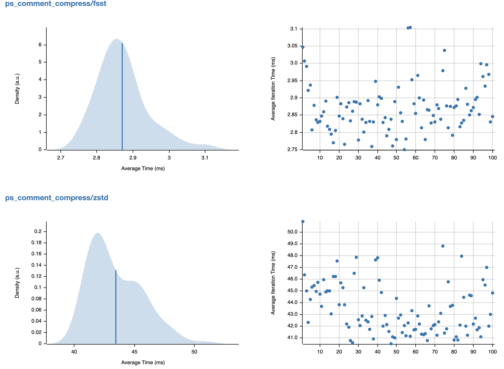
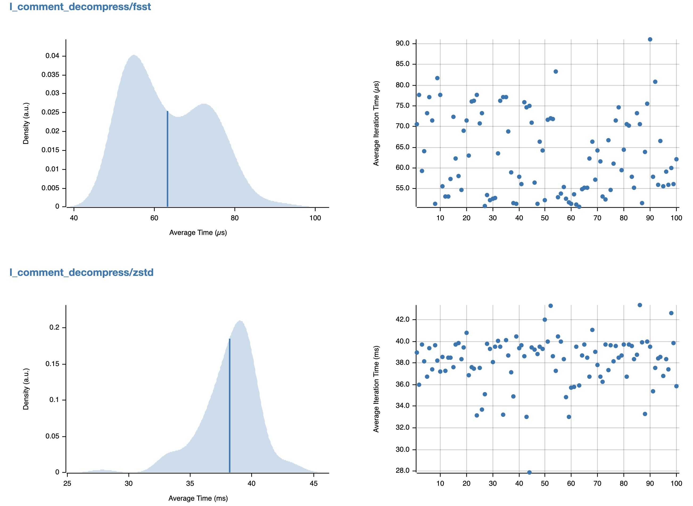

# FSST-Rust

A pure rust implementation of
the [Fast Static Symbol Table](https://github.com/cwida/fsst/raw/master/fsstcompression.pdf).

## Usage

de/compress a single string

```rust
let str = "tumcwitumvldb";
let (symbol_table, encoding) = encode_string(str, false);
println!("built symbol table: {}", symbol_table.to_string()); // [b, t, w, tumc, witumvld]
assert_eq!(str, decode_string(&symbol_table, &encoding));

let table_bytes = symbol_table.dump();
let decoder = Decoder::from_table_bytes( & table_bytes);
assert_eq!(str, decoder.decode(&encoding));

let compress_factor = str.len() as f64 / encoding.len() as f64;
println!("compression factor: {:.4}", compress_factor);
```

batch de/compress strings

```rust
let compress_file_path = "assets/test_data/ps_comment".to_string();
let strings = read_string_lines(compress_file_path).unwrap();

let mut start_time = std::time::Instant::now();
let (symbol_table, encodings) = encode_all_strings( & strings);
let compress_time = start_time.elapsed();

start_time = std::time::Instant::now();
let decode_strings = decode_all_strings( & symbol_table, & encodings);
let decompress_time = start_time.elapsed();

let mut encoding_size = symbol_table.dump().len();
let mut total_size = 0;
for i in 0..strings.len() {
total_size += strings[i].len();
encoding_size += encodings[i].len();
assert_eq ! (strings[i], decode_strings[i]);
}

let compress_factor = total_size as f64 / encoding_size as f64;
println!("compression factor: {:.4}", compress_factor);
println!("compression cost time: {}ms", compress_time.as_millis());
println!("decompression cost time: {}ms", decompress_time.as_millis());
```

## MircoBench

`cargo bench`

MircoBench Environment:

```
Architecture:        x86_64
Model name:          Intel(R) Xeon(R) CPU E5-2630 v4 @ 2.20GHz
```

### compression on TPC-H data of ps_comment at string level



### decompression on TPC-H data of l_comment at string level



## License

FSST-Rust is under the Apache-2.0 license. See the [LICENSE](./LICENSE) file for details.

## Acknowledgement

Thanks to the authors Peter Boncz, Thomas Neumann, and Viktor Leis
for providing the powerful [FSST](https://github.com/cwida/fsst/raw/master/fsstcompression.pdf). Here is the original
algorithm repository: https://github.com/cwida/fsst.